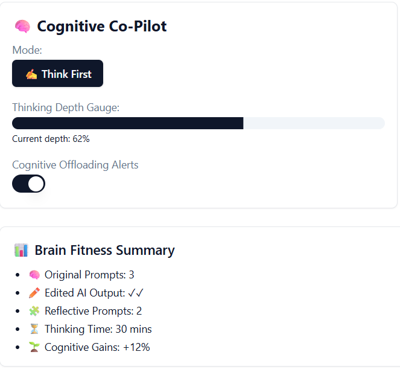

# Cognitive Copilot
App to help you maintain your cognitive and brain skills while using AI.

AI can be helpful and changes are happening. It is designed to aid humans but has various risks.

Your brain and cognitive skills can diminish with LLM use, but can also be built up - AI smart! 

It's June 2025. Yes, the data is already coming in. Tech optimists will counter this with valid points. Consider an analogy: modernization of jobs saw people move away from farm and industrialized roles into offices and other positions. Physical exercise wasn't built into work. I am writing this from a gym. With AI, you have to maintain your brain and cognitive skills!

It's on you. Let's get ahead of this - society failed with social media not knowing early.

This week, I've several mentions in media this week, and have thought this through quite a bit myself.

Students are using AI to write papers and losing critical thinking skills. AI agents are being created to work alongside you in the workplace. 

- [MIT study explores how ChatGPT is quietly shaping human thought](https://computeruser.com/mit-study-explores-how-chatgpt-is-quietly-shaping-human-thought)

- [WSJ - the biggest AI threat to young people who cant think](https://www.wsj.com/opinion/the-biggest-ai-threat-young-people-who-cant-think-303be1cd)

- [Dr. Caroline Leaf - Neuroscientist Revals How AI is Rewiring Your Brain - Podcast](https://podcasts.apple.com/us/podcast/neuroscientist-reveals-how-ai-is-rewiring-your-brain/id1334767397?i=1000711178101)

This project is a concept tool like a Pomodoro timer, task and time management techniques and tools, and more!

My dialog with ChatGPT regarding this, and vibe coding start of an app to manage this.

[A little chat with OpenAI ChatGPT about this...](https://chatgpt.com/share/6859d2fb-2d78-800d-b054-4e041f7b7b68)

